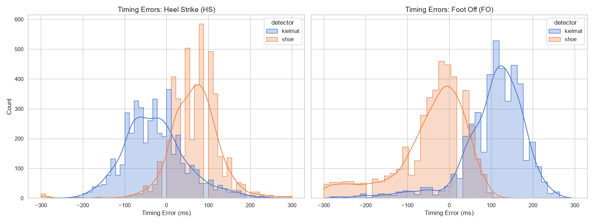
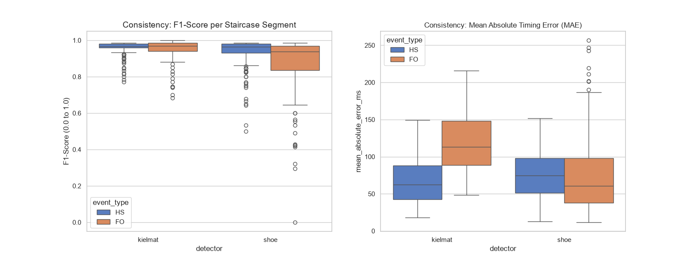
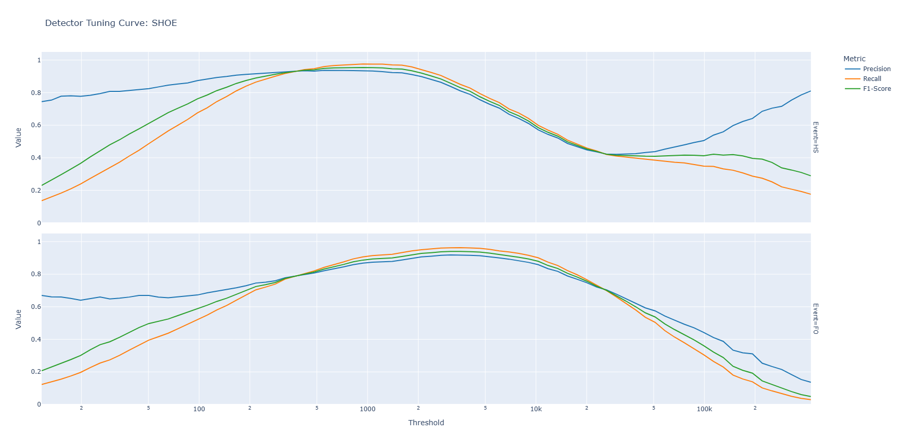
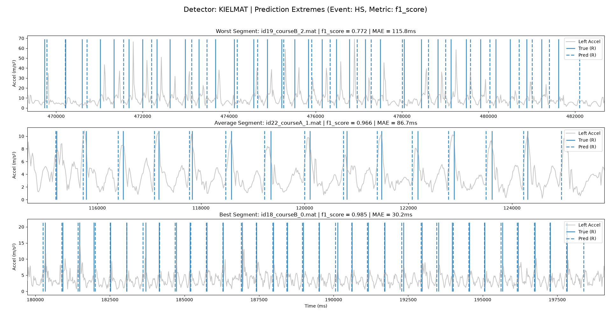

# StairsUp: Step Detection Analysis

This repository is a pipeline to isolate target surfaces from the [NEWBEE](https://springernature.figshare.com/collections/NEWBEE_A_Multi-Modal_Gait_Database_of_Natural_Everyday-Walk_in_an_Urban_Environment/5758997/1) and [OSF](https://osf.io/sgbw7/overview) datasets and evaluate the performance of step detection algorithms. The original goal was to indentify the best threshold on the stairs up surface for the [SHOE](https://github.com/utiasSTARS/pyshoe) detector. The way this is done is by looking at the curves produced by the `data_analysis.py` module.

## Main Plots






## Directory Structure

```text
|-- data
|   |-- osf_{TARGET_SURFACE}							<-- output data from the OSF Dataset (on stairs up sections)
|   |-- newbee_{TARGET_SURFACE}							<-- output data from the NEWBEE dataset (on stairs up sections)
|   |-- newbee									    	<-- NEWBEE Dataset
|	|	`-- CourseA
|	|		`-- id01
|	|			|-- label.csv							<-- Contains ground truth timings and surface labels
|	|			`-- xsens.csv							<-- IMU data
|	|
|   `-- osf
|		`-- healthy
|			`-- subject_01
|				|-- part_1
|				|	|-- imu\							<-- Binary IMU data
|				|	`-- manual_annotation_z_level.csv	<-- Contains ground truth timings and surface labels
|				`-- part_2
|-- python_code
|   |-- Toolboxes\
|   |-- src\
|   |-- tests\
|   |-- data_analysis.py
|   |-- newbee_runner.py
|   `-- osf_runner.py
`-- requirements.txt
```

---

## Getting Started

**Recommended Python version:** 3.11

1. Clone the repository and navigate to the project root.
2. Ensure the NEWBEE and OSF databases are downloaded and placed in the `data` directory.
3. Install the required dependencies:

```shell
StairsUp> pip install -r requirements.txt
```

*SciPy<=1.14.0 is important for Kielmat*

## Pipeline Overview

### 1. Running the Data Extraction and Processing Code

The pipeline uses separate runners for the distinct datasets to extract the real ground-truth events and evaluate them through the toolboxes. Run the `osf_runner` and `newbee_runner` located in the `python_code` directory. Run them to output `.mat` files to `data/{DATASET_NAME}_{TARGET_SURFACE}/{DETECTOR_NAME}`, later used for data analysis. 

```shell
StairsUp> python -m python_code.newbee_runner
StairsUp> python -m python_code.osf_runner
```

### 2. Data Analysis and Visualization

Run the `data_analysis.py` script to generate summary statistics (Precision, Recall, F1-Score, MAE) and match predictions to the real ground truth using Hungarian matching.

```shell
StairsUp> python -m python_code.data_analysis
```

You can also generate detector-specific plots showcasing the worst, median, and best predictions using the `-d` switch:

```shell
StairsUp> python -m data_analysis.py -d shoe
```

## Customizability features

You can choose to extract other surfaces by changing the `TARGET MODE` constant on line 34 of `newbee_runner.py`:

```python
34     TARGET_MODE = "stairs_up" # CHANGE THIS: to see other surfaces
```
and line 33 of `osf_runner.py`. Note the difference between **stairs** and **stair** does matter due to different naming conventions in the 2 datasets.
```python
33     TARGET_MODE = "stair_up" # CHANGE THIS: to see other surfaces
```

You can choose to exclude the worst `N` segments, adjust the data set and surface you want to visualize by changing line 566-568 in `data_analysis.py`. Note that you will need to run the `osf_runner` and `newbee_runnner` before switching to another surface:

```python
566    TARGET_SURFACE = "stair_up"  # Change this to your target surface if needed
567    TARGET_DATASET = 'newbee'  # Change this to your target dataset if needed
568    EXCLUDE_WORST_N = 50  # Number of worst segments to drop for summary statistics
```


## Using on Custom Data

To apply the PyShoe pipeline to other data segments, utilize the `pyshoe_process_single_file` function found in the `pyshoe_export.py` script:

```python
from python_code.Toolboxes.PyShoe.pyshoe_export import pyshoe_process_single_file

def pyshoe_process_single_file(
    segment: pd.DataFrame, 
    has_gravity: bool,
    course: str, 
    id: str, 
    clip_id: int,
    true_hs_r: pd.DataFrame | np.ndarray, 
    true_fo_r: pd.DataFrame | np.ndarray, 
    true_hs_l: pd.DataFrame | np.ndarray, 
    true_fo_l: pd.DataFrame | np.ndarray, 
    output_path: Path,
    fs: float
) -> str:
```
